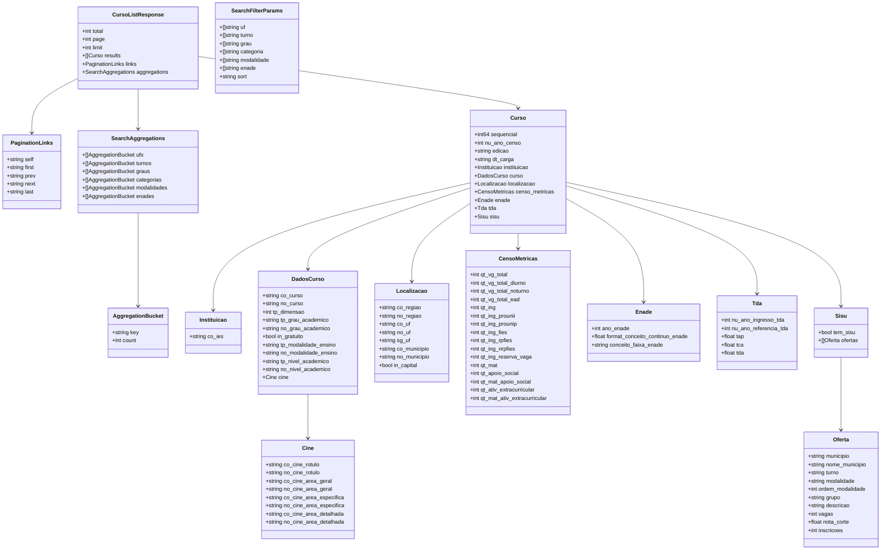

# Diagrama da API — Módulo de Cursos

## Modelagem de Dados (`models.go`)

### Diagrama de Classes e Estruturas

---

## Parâmetros de Entrada e Tratamento de Erros

### Query Parameters Aceitos pelo Endpoint `GET /cursos`

| Parâmetro | Tipo | Obrigatório | Padrão | Descrição |
| :--- | :--- | :--- | :--- | :--- |
| `q` | `string` | **Sim** | — | Termo de busca textual (ex: `"medicina"`, `"direito"`, `"engenharia"`) |
| `page` | `int` | Não | `1` | Número da página para paginação |
| `limit` | `int` | Não | `20` | Quantidade de itens por página (mínimo 1, máximo 100) |
| `uf` | `string` / `[]string` | Não | — | Filtro de estado(s), ex: `uf=SP` ou `uf=SP,RJ` |
| `turno` | `string` / `[]string` | Não | — | Filtro de turno (`diurno`, `noturno`, `integral`, `ead`) |
| `grau` | `string` / `[]string` | Não | — | Filtro de grau acadêmico (`bacharelado`, `licenciatura`, `tecnologico`) |
| `categoria` | `string` / `[]string` | Não | — | Filtro de categoria administrativa (`privada`, `federal`, `estadual`, `municipal`) |
| `modalidade` | `string` / `[]string` | Não | — | Filtro de modalidade de ensino (`presencial`, `ead`) |
| `enade` | `string` / `[]string` | Não | — | Filtro de conceito ENADE faixa (`1`, `2`, `3`, `4`, `5`) |
| `sort` | `string` | Não | `_score` | Critério de ordenação (`enade`, `desistencia`, `az`) |

### Respostas e Códigos HTTP

- **`200 OK`**: Retorna objeto `CursoListResponse` em JSON.
- **`400 Bad Request`**: Parâmetro `q` ausente ou inválido.
- **`405 Method Not Allowed`**: Método HTTP diferente de `GET`.
- **`500 Internal Server Error`**: Falhas de comunicação com o Elasticsearch ou erro interno no processamento.
