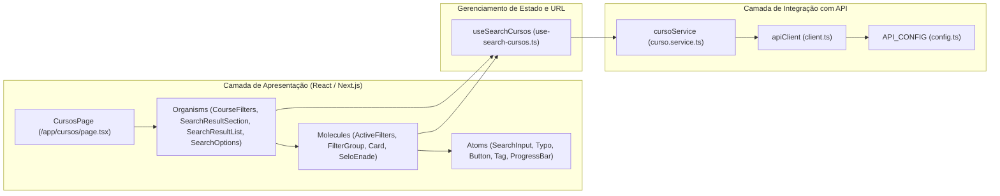
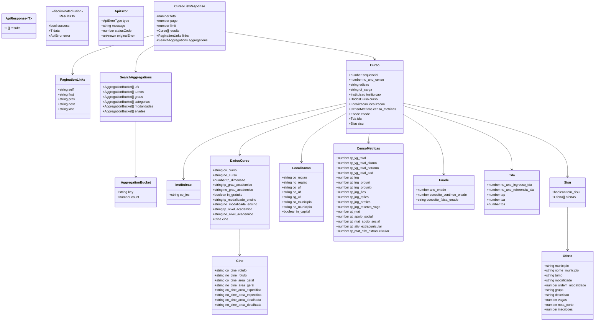

# Diagrama do Frontend — Busca e Visualização de Cursos

Documentação do fluxo de dados, sincronização com URL, consumo da API e renderização de componentes no pacote `packages/front/`.

---

## 1. Visão Geral do Fluxo da Informação

O fluxo de busca no frontend conecta as ações do usuário na interface, a sincronização de estado com a URL do Next.js App Router, as chamadas HTTP tipadas à API Go e a renderização dos resultados e filtros.

```mermaid
flowchart TD
    User[Usuário] -->|digita termo de busca| SearchInput[SearchInput / SearchFilters]
    User -->|seleciona filtro| CourseFilters[CourseFilters / FilterGroup]
    User -->|altera ordenação| SearchOptions[SearchOptions]
    User -->|remove filtro| ActiveFilters[ActiveFilters]
    User -->|troca de página| Pagination[SearchPagination]

    SearchInput -->|setQuery| Hook[useSearchCursos Hook]
    CourseFilters -->|updateParams| Hook
    SearchOptions -->|updateParams| Hook
    ActiveFilters -->|updateParams / resetFilters| Hook
    Pagination -->|navigateToPage| Hook

    subgraph StateAndURL["Sincronização de Estado e URL"]
        Hook <-->|useSearchParams / useRouter.replace| URL[(URL SearchParams<br/>?q=...&page=...&uf=...&turno=...&sort=...)]
        Hook -->|useEffect quando query >= 5 chars| ServiceCall[cursoService.searchCursos]
    end

    subgraph ServiceLayer["Camada de Serviço e HTTP Client"]
        ServiceCall -->|monta URLSearchParams| Client[apiClient]
        Client -->|fetch GET /cursos?q=...| API[API Go Backend]
        API -->|JSON CursoListResponse| Client
        Client -->|Result: success ? data : emptyResponse| ServiceCall
        ServiceCall -->|CursoListResponse| Hook
    end

    subgraph ComponentTree["Renderização dos Componentes (/cursos)"]
        Hook -->|results: Curso[]| ResultList[SearchResultList]
        Hook -->|aggregations: SearchAggregations| CourseFilters
        Hook -->|links: PaginationLinks, total, limit| Pagination
        Hook -->|isLoading, error| ResultList

        ResultList -->|itera resultados| Item[SearchResultItem]
        Item --> CardRoot[Card]
        CardRoot --> CardHeader[Card.Header: Nome do Curso • Localização]
        CardRoot --> CardEnade[Card.IconEnade: Selo 1 a 5]
        CardRoot --> CardTags[Card.Tags: Gratuito, Modalidade, Turno, Grau]
        CardRoot --> CardProgress[Card.ProgressBar: Nota de Corte SISU]
    end
```

---

## 2. Camadas da Aplicação Frontend



---

## 3. Tipagem e Modelagem de Dados (`types.ts`)

A camada de tipos reflete a estrutura retornada pelo backend Go e provê contratos seguros para o consumo no React.



---

## 4. Funcionamento dos Hooks e Componentes

### 1. `useSearchCursos` (`use-search-cursos.ts`)
- **Sincronização com URL**: Lê os parâmetros de busca (`q`, `page`, `limit`, `uf`, `turno`, `grau`, `categoria`, `modalidade`, `enade`, `sort`) da URL via `useSearchParams` e atualiza a URL via `router.replace`.
- **Validação de Entrada**: Dispara a busca apenas quando o termo `q` possui pelo menos 5 caracteres (`API_CONFIG.SEARCH_MIN_CHARS = 5`).
- **Estados Expostos**:
  - `results: Curso[]`: Lista de cursos retornados.
  - `isLoading: boolean`: Indicador de requisição em andamento.
  - `error: string | null`: Mensagem de erro amigável caso ocorra falha.
  - `total: number`: Total de registros encontrados no Elasticsearch.
  - `links: PaginationLinks | null`: Links de paginação HATEOAS.
  - `aggregations: SearchAggregations | null`: Contadores por filtro para exibição dinâmica nas facetas.
- **Ações Expostas**: `setQuery`, `navigateToPage`, `updateParams`, `resetFilters`.

### 2. `CourseFilters` & `FilterGroup` (`course-filters.tsx`)
- Renderiza grupos colapsáveis e opções de filtro para **Estado**, **Turno**, **Grau Acadêmico**, **Categoria**, **Modalidade** e **Conceito ENADE**.
- Vincula dinamicamente a contagem de resultados (`resultCount`) usando os dados retornados em `aggregations` da API.

### 3. `ActiveFilters` (`active-filters.tsx`)
- Mapeia todos os filtros atualmente presentes na URL e exibe etiquetas (chips/badges) com botão para remoção individual ou limpeza global ("Limpar filtros").

### 4. `SearchResultItem` (`search-result-item.tsx`)
- Extrai e exibe os dados de cada item `Curso`:
  - Nome do curso e localização formatada (`Município - UF`).
  - Conceito ENADE no selo visual (`Card.IconEnade` / `SeloEnade`).
  - Tags dinâmicas: `Gratuito`, modalidade de ensino, turno e grau acadêmico.
  - Barra de progresso da nota de corte SISU (`Card.ProgressBar`) relativa à pontuação máxima (1000).
