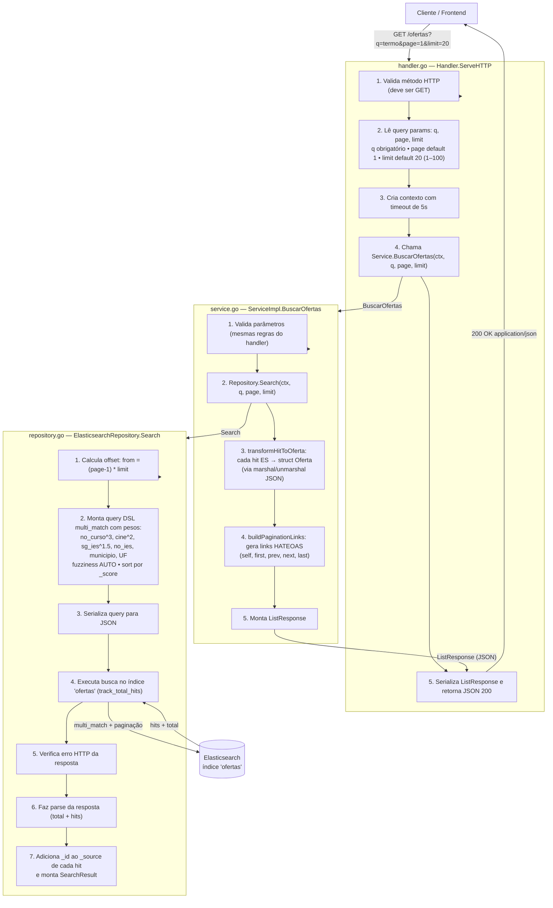
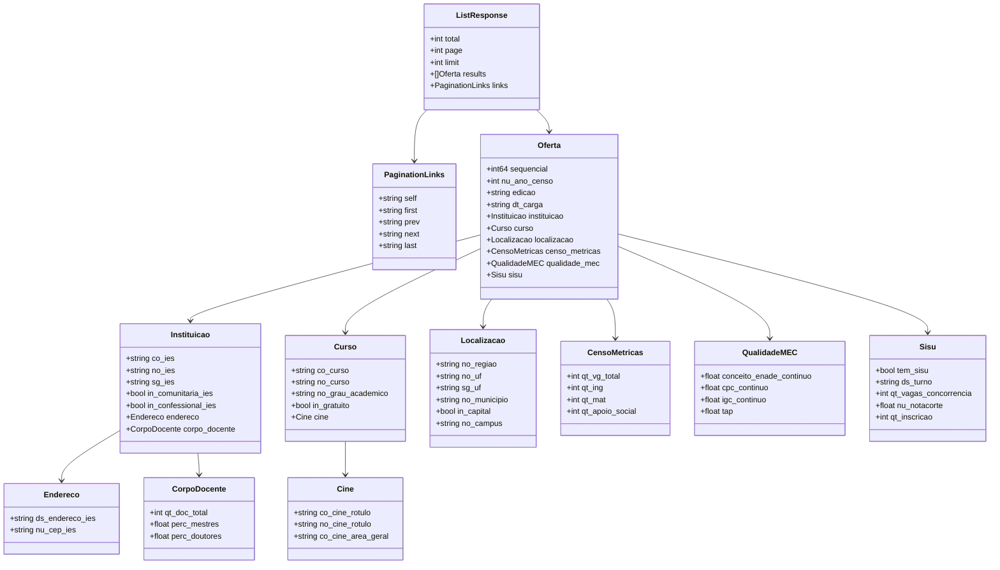

# Diagrama da API — Módulo de Ofertas

Visão do fluxo de informação do endpoint `GET /ofertas`, no pacote `packages/api/internal/features/ofertas/`.

## Visão geral

## Camadas e responsabilidades

## Modelos de dados (models.go)

## Fluxo da informação (resumo textual)

1. **Handler** (`handler.go`) recebe `GET /ofertas?q=&page=&limit=`, valida o método e os parâmetros (`q` obrigatório; `page` mínimo 1; `limit` entre 1 e 100), aplica timeout de 5s no contexto e delega para o service.
2. **Service** (`service.go`) revalida os parâmetros, chama o repositório, converte cada documento do Elasticsearch em `Oferta` (via marshal/unmarshal JSON — hits inválidos são ignorados, apenas logados), gera os links HATEOAS de paginação e monta o `ListResponse`.
3. **Repository** (`repository.go`) calcula o offset `(page-1)*limit`, monta a query DSL `multi_match` (busca em `curso.no_curso^3`, `cine.no_cine_rotulo^2`, `instituicao.no_ies`, `sg_ies^1.5`, município e UF, com `fuzziness: AUTO`), executa a busca no índice `ofertas`, trata erros HTTP do Elasticsearch, faz o parse da resposta e anexa `_id` ao `_source` de cada hit.
4. **Response** é serializada pelo handler como JSON (`200 OK`). Erros: `400` para `q` ausente, `405` para método inválido, `500` para falhas internas.
