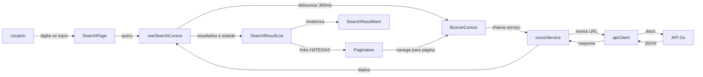

# Diagrama do Frontend — Busca de Cursos

Resumo do fluxo da informação da busca de cursos.

## Resumo

1. **Usuário** digita no input e o componente `SearchPage` envia a query para o hook `useSearchCursos`.
2. **Hook** aplica debounce de 300ms, limita a busca a queries de 5+ caracteres e controla estado, loading e erros.
3. **cursoService** monta a URL `GET /cursos` e chama o `apiClient`, que faz o `fetch` contra a API Go via proxy `/api`.
4. **Resposta JSON** volta por `apiClient` → `cursoService` → hook, que atualiza os resultados.
5. **SearchResultList** renderiza cada resultado em um `SearchResultItem` e usa `Pagination` com os links HATEOAS da API para navegar entre páginas.